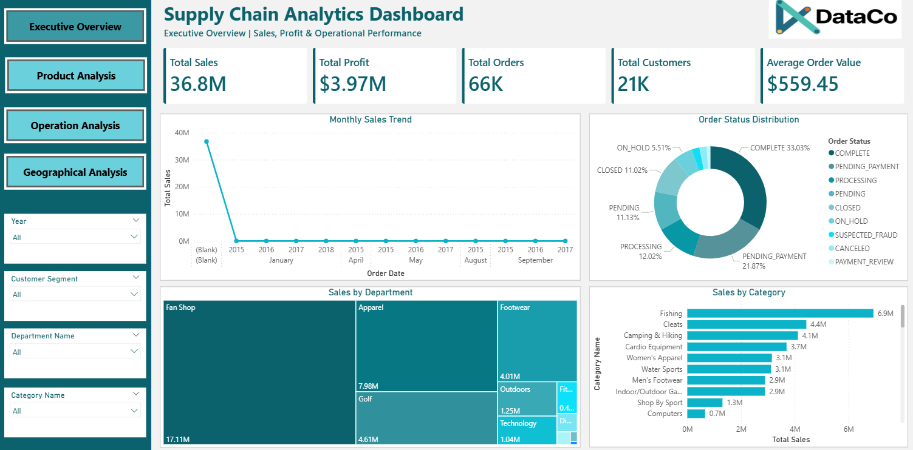
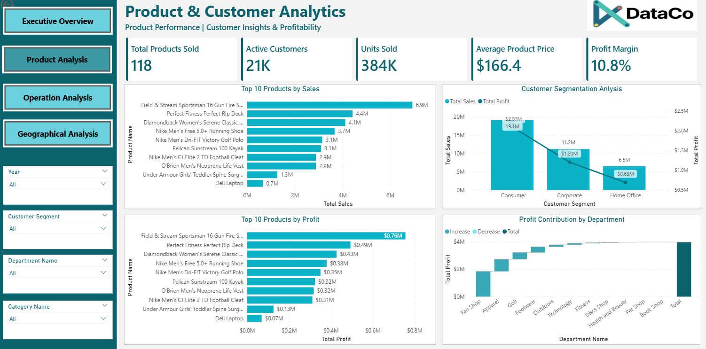
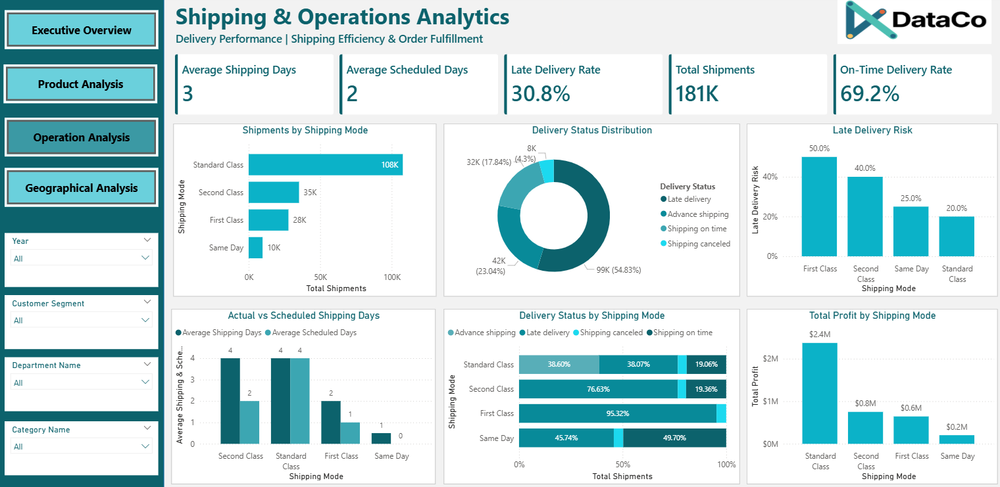
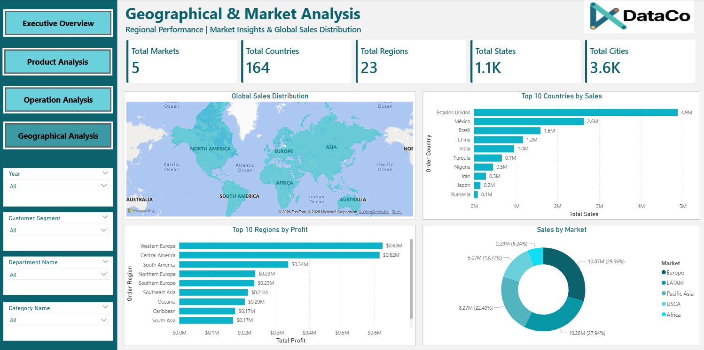

# Supply Chain Analytics Dashboard

## Overview

The Supply Chain Analytics Dashboard is an end-to-end Business Intelligence project developed to analyze supply chain operations, product performance, customer behavior, shipping efficiency, and geographical sales distribution. The project demonstrates the complete data analytics workflow, from data cleaning and normalization to SQL querying and interactive dashboard development.

The project was built using Python for data preprocessing, MySQL for data storage and querying, and Power BI for visualization and business reporting.

---

## Objectives

- Analyze overall sales and profitability.
- Monitor product and customer performance.
- Evaluate shipping efficiency and delivery performance.
- Identify high-performing markets, countries, and regions.
- Build an interactive dashboard for business decision-making.

---

## Tech Stack

- Python
- Pandas
- NumPy
- MySQL
- Power BI
- DAX

---

## Project Workflow

### 1. Data Cleaning and Preparation (Python)

- Cleaned and validated the raw dataset.
- Removed inconsistencies and unnecessary columns.
- Converted mixed date formats into standard datetime format.
- Handled duplicate and missing records.
- Performed Exploratory Data Analysis (EDA).

---

### 2. Database Normalization

The original dataset was normalized into multiple relational tables following a star schema approach.

Tables created:

- Customers
- Products
- Categories
- Departments
- Shipping
- Locations
- Orders
- Date

---

### 3. SQL Implementation

- Imported normalized tables into MySQL.
- Created primary keys and foreign keys.
- Performed business analysis using SQL queries.
- Validated KPIs before dashboard creation.

---

### 4. Dashboard Development (Power BI)

Created a four-page interactive dashboard with synchronized slicers.

---

## Dashboard Pages

### Page 1 — Executive Overview

KPIs

- Total Sales
- Total Profit
- Total Orders
- Total Customers
- Average Order Value

Visualizations

- Monthly Sales Trend
- Sales by Category
- Sales by Department
- Order Status Distribution

---

### Page 2 — Product & Customer Analytics

KPIs

- Total Products Sold
- Active Customers
- Units Sold
- Average Product Price
- Profit Margin

Visualizations

- Top 10 Products by Sales
- Top 10 Products by Profit
- Customer Segmentation Analysis
- Profit Contribution by Department (Waterfall Chart)

---

### Page 3 — Shipping & Operations Analytics

KPIs

- Average Shipping Days
- Average Scheduled Days
- Late Delivery Rate
- Total Shipments
- On-Time Delivery Rate

Visualizations

- Shipments by Shipping Mode
- Delivery Status Distribution
- Late Delivery Risk
- Actual vs Scheduled Shipping Days
- Delivery Status by Shipping Mode
- Total Profit by Shipping Mode

---

### Page 4 — Geographical & Market Analysis

KPIs

- Total Markets
- Total Countries
- Total Regions
- Total States
- Total Cities

Visualizations

- Global Sales Distribution (Filled Map)
- Top 10 Countries by Sales
- Sales by Market
- Top 10 Regions by Profit

---

## Dashboard Preview

---

---

---

---

## Dataset Information

| Attribute | Value |
|----------|-------|
| Total Records | 180,519 |
| Total Columns | 48 |
| Fact Table | Orders |
| Dimension Tables | 7 |
| Database | MySQL |

---

## Key Features

- Interactive multi-page dashboard
- Star schema data model
- SQL-based data validation
- Advanced DAX measures
- Dynamic filtering using slicers
- Executive-level KPI reporting
- Product performance analysis
- Customer segmentation
- Shipping and operational analysis
- Geographical sales analysis

---

## Business Insights

- Identified top-performing products and departments.
- Compared customer segments based on sales and profit.
- Evaluated shipping modes and delivery performance.
- Monitored late delivery trends.
- Analyzed market-wise and country-wise sales distribution.
- Identified profitable geographical regions.

---

## Skills Demonstrated

- Data Cleaning
- Data Normalization
- Relational Database Design
- SQL Querying
- DAX
- Data Modeling
- Business Intelligence
- Dashboard Design
- Data Visualization
- Business Analytics

---

## Future Enhancements
- Real-time database connectivity
- Forecasting using Power BI

---

## Author

**Pranjali Sus**

Aspiring Data Analyst | Business Intelligence | Power BI | SQL | Python

---

## ⭐ If you found this project useful, consider giving this repository a star!
